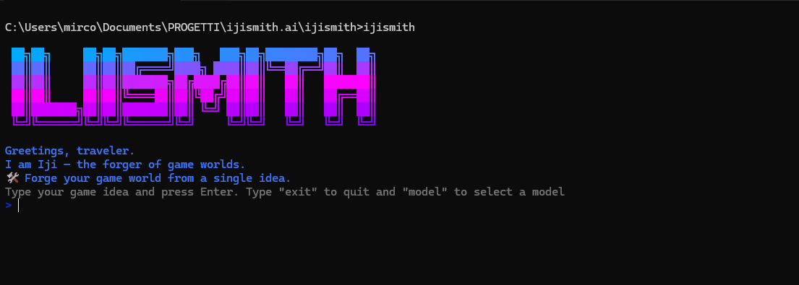

# ijismith


A CLI for brainstorming and structuring game ideas using AI.

This tool uses [OpenRouter](https://openrouter.ai/) to power its AI generation capabilities.

## Installation

1.  **Clone the repository or download the source code.**
2.  **Navigate to the project directory:**
    ```bash
    cd path/to/ijismith
    ```
3.  **Install dependencies:**
    ```bash
    npm install
    ```
4.  **Link the CLI:** This makes the `ijismith` command available globally on your system.
    ```bash
    npm link --force
    ```

## Configuration

1.  **Set up your API Key:**
    *   Create a `.env` file in the root of the project.
    *   Add your OpenRouter API key to it:
        ```
        OPENROUTER_API_KEY=your_api_key_here
        ```
2.  **Select your AI Model:**
    *   Run the `model` command to choose which AI model you want to use.
        ```bash
        ijismith model
        ```
    *   Your choice is saved, so you only need to do this when you want to switch models.

## Usage

### Interactive Mode (Recommended)

To start the application in interactive mode, simply run the `ijismith` command:

```bash
ijismith
```

This will launch a session where you can type your game ideas directly into the terminal. The AI will generate the game structure for each idea you provide. To exit the session, type `exit`.

### Direct Command

For non-interactive use, you can provide the game idea as an argument to the `generate` command:

```bash
ijismith generate "A fantasy adventure game about a young sorcerer trying to lift a curse from their village."
```

This will create a new directory named after your game idea (e.g., `a_fantasy_adventure_game...`) with the following JSON files:

-   `story.json`: The main plot and narrative structure.
-   `characters.json`: Main characters, including the protagonist and antagonist.
-   `items.json`: Important items in the game world.
-   `npcs.json`: Non-playable characters with dialogue.

### JSON Structure

The generated JSON files are based on the skeletons found in the `data/` directory. You can modify these skeletons to change the output structure.

#### `characters.json` and `items.json` Abilities

The `abilities` field in `characters.json` and `items.json` has the following structure:

```json
"abilities": [
  {
    "ability": "Fireball",
    "ability_stats": [
      {
        "stat": "damage",
        "value": 10
      },
      {
        "stat": "mana_cost",
        "value": 5
      }
    ]
  },
  {
    "ability": "Invisibility",
    "ability_stats": -1
  }
]
```

If an ability has no stats, the `ability_stats` value will be `-1`.
